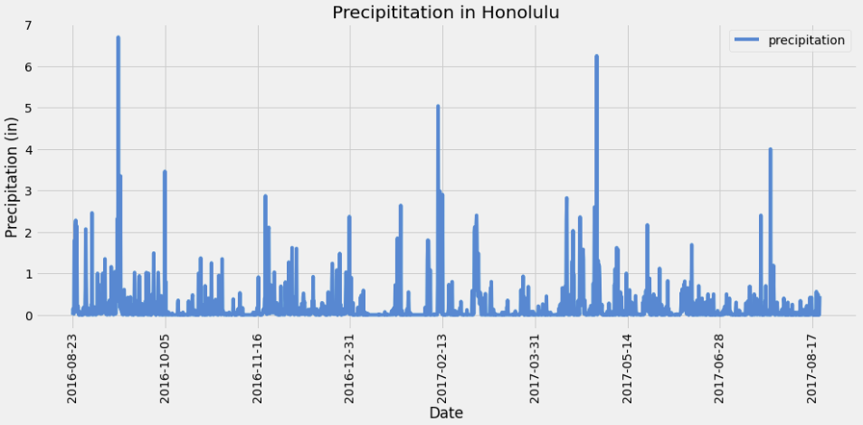
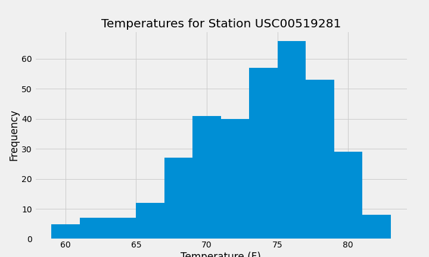
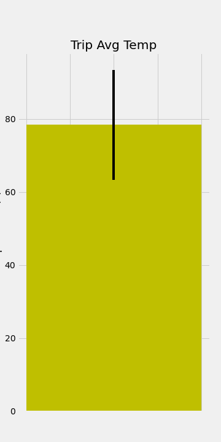
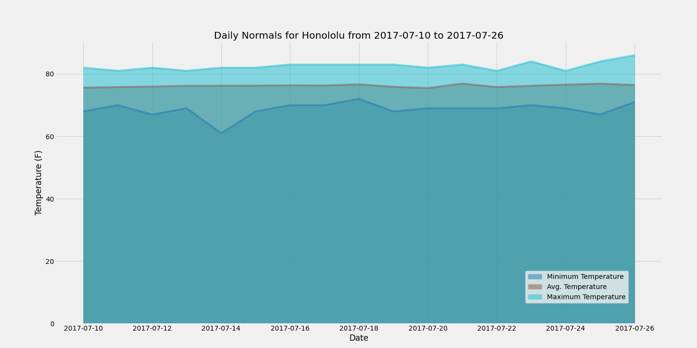

# SQLAlchemy Challenge
The following work presents the analysis of temperatures in Honololu, Hawai for a trip planed between July 10-26.

## Climate Analysis and Exploration

## Data Inspection
There are 2 tables available: Measurements and Stations.
* Measurements table contains: Precipitation (prcp), station, temperature (tobs), date and id. It has 19,550 rows.
* Station table contains: station, id, elevation, name, longitude and latitude. It has 9 rows.

The last date of available data is: 2017/08/23.

The following plot presents the last 12 months of precipitation data in Honolulu, HI.

## Climate App
